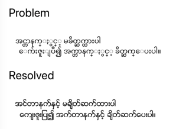
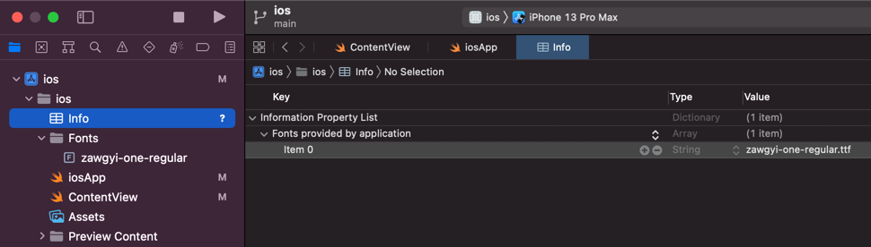

# fix-myanmar-font



### Android

- Add font `zawgyi_one_regular.ttf` file

```
main
└── res
    └── font
        ├── zawgyi_one.xml
        └── zawgyi_one_regular.ttf
```

- Add xml `zawgyi_one.xml` file

```xml
<?xml version="1.0" encoding="utf-8"?>
<font-family xmlns:app="http://schemas.android.com/apk/res-auto">
	<font app:font="@font/zawgyi_one_regular" app:fontStyle="normal" app:fontWeight="400" />
	<font app:font="@font/zawgyi_one_regular" app:fontStyle="normal" app:fontWeight="700" />
</font-family>
```

- Use

```xml
<TextView
    android:id="@+id/example_text"
    android:layout_width="0dp"
    android:layout_height="wrap_content"
    android:fontFamily="@font/zawgyi_one"
    android:text="အင္တာနက္ႏွင့္ မခ်ိတ္ဆက္ထားပါ\n  ေက်းဇူးျပဳ၍ အက္တာနက္ႏွင့္ ခ်ိတ္ဆက္ေပးပါ။"
    android:textSize="18sp" />
```

### iOS

- Add font `zawgyi-one-regular.ttf` file



- Use

```swiftui
Text("အင္တာနက္ႏွင့္ မခ်ိတ္ဆက္ထားပါ\n  ေက်းဇူးျပဳ၍ အက္တာနက္ႏွင့္ ခ်ိတ္ဆက္ေပးပါ။")
    .font(.custom("Zawgyi-One", size: 18))
```
